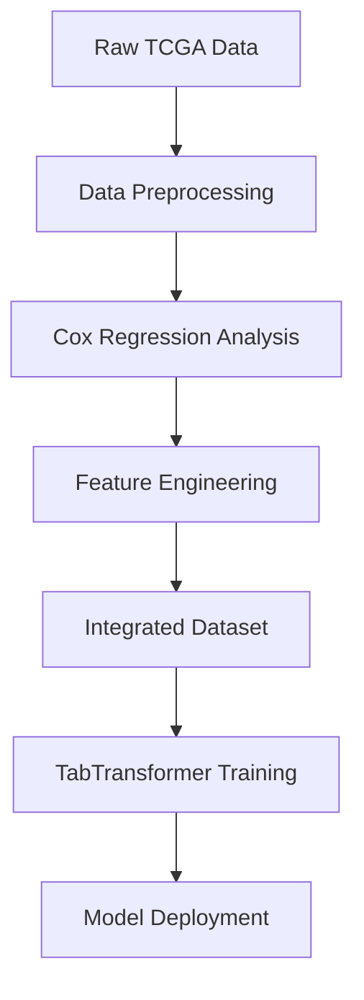

# 🧬 Cancer Foundation Model

**A Comprehensive Multi-Modal AI System for Cancer Prognosis and Analysis**

[](https://www.python.org/downloads/release/python-380/)
[](https://pytorch.org/)
[](https://developer.nvidia.com/cuda-zone)

## 🎯 Overview

The Cancer Foundation Model is a state-of-the-art multimodal AI system designed to revolutionize cancer prognosis prediction through the integration of:

- **🧬 Multi-Omics Data**: Expression, CNV, miRNA, RPPA, Mutation profiles
- **🔬 Methylation Profiles**: High-dimensional β-value analysis  
- **📊 Clinical Data**: Patient demographics and treatment history
- **🖼️ Histopathology Images**: Whole Slide Image (WSI) analysis

## 🏗️ Architecture & Data Flow

### 전체 데이터 처리 흐름 (Complete Data Processing Pipeline)



### Phase 1: Data Engineering ✅
- **Raw Data Processing**: TCGA PanCancer 데이터 다운로드 및 전처리
- **Cox Regression**: 5개 오믹스 타입별 생존 분석 및 계수 계산
- **Feature Engineering**: Cox 계수를 가중치로 활용한 특성 변환
- **Data Integration**: 환자 중심 통합 데이터 테이블 구축
- **Quality Control**: 결측값 처리 및 정규화

### Phase 2: Core Models ✅
- **2-1: TabTransformer** ✅ - Multi-omics 및 methylation 분석 (lucidrains/tab-transformer-pytorch 기반)
- **2-2: Training Pipeline** ✅ - End-to-end 모델 훈련 파이프라인
- **2-3: Model Evaluation** ✅ - 성능 평가 및 검증 시스템

### Phase 3: Multimodal Fusion ⏳
- **Modality Integration**: Cross-attention mechanisms
- **LLM Fine-tuning**: Foundation model enhancement
- **Knowledge Distillation**: Model compression

### Phase 4: Deployment ⏳
- **Model Evaluation**: Comprehensive benchmarking
- **Visualization Tools**: Interactive analysis dashboard
- **Clinical Integration**: Real-world deployment pipeline

## 🔬 Technical Innovation

### TabularTransformer Architecture
```python
# Cox-Enhanced Multi-Omics Processing (lucidrains/tab-transformer-pytorch based)
CoxTabTransformer(
    clinical_categories=(5, 3, 4),           # Categorical clinical features
    num_omics_features=1000,                 # [measured_value, cox_coefficient] pairs
    architecture="Real TabTransformer + Cox integration",
    output="3-year survival prediction"
)

# High-Dimensional Methylation Analysis with Feature Selection
MethylationTabTransformer(
    num_probes=450000,                       # Full methylation array
    selected_probes=5000,                    # Learnable feature selection
    feature_selection="Neural attention-based top-k selection",
    output="Binary survival classification"
)
```

### Key Features
- **🎯 Survival-Focused**: 3-year survival binary classification endpoint
- **⚡ Efficient Processing**: Dynamic feature selection for high-dimensional data
- **🧠 Interpretable**: Attention-based feature importance extraction
- **🔄 Modular Design**: Easy integration of additional data modalities

## 📊 Dataset & Processing Details

### 1단계: Raw Data (TCGA PanCancer)
```
data/raw/
├── Expression: unc.edu_PANCAN_IlluminaHiSeq_RNASeqV2.geneExp_whitelisted.tsv
├── CNV: CNV.GISTIC_call.all_data_by_genes_whitelisted.tsv  
├── miRNA: bcgsc.ca_PANCAN_IlluminaHiSeq_miRNASeq.miRNAExp_whitelisted.tsv
├── RPPA: mdanderson.org_PANCAN_MDA_RPPA_Core.RPPA_whitelisted.tsv
├── Mutations: tcga_pancancer_082115.vep.filter_whitelisted.maf.gz
├── Methylation: jhu-usc.edu_PANCAN_HumanMethylation450.betaValue_whitelisted.tsv
└── Clinical: clinical_PANCAN_patient_with_followup.tsv
```

### 2단계: Cox Regression Analysis (01_cox_feature_engineering.ipynb)
- **목적**: 각 특성의 생존에 대한 영향력 계산
- **방법**: 암종별(27개)로 Cox proportional hazards 모델 적용
- **결과**: 
  ```python
  cox_coefficients_expression.parquet  # 20,531 genes × 27 cancer types
  cox_coefficients_cnv.parquet         # 25,128 genes × 27 cancer types
  cox_coefficients_microrna.parquet    # 1,071 miRNAs × 27 cancer types
  cox_coefficients_rppa.parquet        # 387 proteins × 27 cancer types
  cox_coefficients_mutations.parquet   # 25,423 genes × 27 cancer types
  ```

### 3단계: Integrated Dataset (03_integrated_dataset.ipynb)
- **Cox-Enhanced Multi-Omics**: `integrated_table_cox.parquet`
  - **차원**: 4,504 patients × 32,762 features
  - **구조**: [measured_value × cox_coefficient] pairs per feature
  - **메모리**: 563 MB
  
- **Methylation Data**: `methylation_table.parquet`  
  - **차원**: 8,224 patients × 50,008 probes (variance filtered)
  - **구조**: β-values (0-1 range), Cox 계수 없음
  - **메모리**: 1.57 GB

### 4단계: TabTransformer Input Format
```python
# CoxTabTransformer Input
clinical_categorical = torch.tensor([[2, 1, 0, 3], ...])  # 범주형 임상변수
omics_continuous = torch.tensor([[                        # [값, Cox계수] 쌍들
    gene1_value * gene1_coef, gene1_coef,                # Expression
    cnv1_value * cnv1_coef, cnv1_coef,                   # CNV
    ...
], ...])

# MethylationTabTransformer Input  
methylation_data = torch.tensor([[0.456, 0.789, ...]])   # β-values만 (450K → 5K 선택)
```

### Data Quality & Statistics
- **총 환자 수**: 4,504명 → 2,444명 (유효한 생존 데이터)
- **생존 분포**: 62.8% (3년 생존), 37.2% (3년 내 사망)
- **암종**: 27개 타입 (BRCA, LUAD, COAD, ...)
- **특성 수**: 
  - Multi-omics: 72,540개 특성 (Cox 적용)
  - Methylation: 450,000개 → 50,008개 (variance filtering)

## 🚀 Quick Start

### 환경 설정
```bash
git clone https://github.com/your-org/cancer-foundation-model.git
cd cancer-foundation-model
pip install -r requirements.txt

# TabTransformer 라이브러리 설치
pip install tab-transformer-pytorch
```

### 데이터 처리 및 훈련 (전체 파이프라인)

#### 1단계: Cox 회귀 분석 실행
```bash
cd notebooks
jupyter notebook 01_cox_feature_engineering.ipynb
# 또는
python 01_cox_feature_engineering.py
```

#### 2단계: 통합 데이터셋 생성  
```bash
jupyter notebook 03_integrated_dataset.ipynb
# 또는
python 03_integrated_dataset.py
```

#### 3단계: TabTransformer 모델 훈련
```bash
# CoxTabTransformer 훈련 (Multi-omics)
python src/training/train_tabtransformer.py --model cox --epochs 50 --batch_size 32 --lr 1e-4

# MethylationTabTransformer 훈련 (High-dimensional)
python src/training/train_tabtransformer.py --model methylation --epochs 30 --batch_size 16 --lr 5e-5
```

### 프로그래밍 인터페이스
```python
from src.models.cox_tabtransformer import CoxTabTransformer
from src.models.methylation_tabtransformer import MethylationTabTransformer
from src.utils.tabtransformer_utils import load_cox_coefficients_by_omics

# Cox 계수 로드
_, cox_coefficients = load_cox_coefficients_by_omics('data/processed')

# Cox-enhanced multi-omics model (lucidrains TabTransformer 기반)
cox_model = CoxTabTransformer(
    clinical_categories=(10, 5, 8, 4),      # 임상 범주형 vocab sizes
    num_omics_features=1000,                # Multi-omics 특성 수
    dim=64, depth=4, heads=8                # TabTransformer 설정
)

# High-dimensional methylation model with feature selection
meth_model = MethylationTabTransformer(
    num_probes=50008,                       # Variance filtered probes
    selected_probes=5000,                   # 학습 가능한 특성 선택
    dim=64, depth=3, heads=8
)
```

### 모델 테스트
```bash
python test/test_tabtransformers.py
```

## 📁 Project Structure & File Flow

```
cancer-foundation-model/
├── 📊 data/
│   ├── raw/                           # 원본 TCGA 데이터
│   │   ├── *_expression_whitelisted.tsv       # Gene expression
│   │   ├── CNV.*_whitelisted.tsv              # Copy number variation
│   │   ├── *_miRNASeq_whitelisted.tsv         # microRNA
│   │   ├── *_RPPA_whitelisted.tsv             # Protein (RPPA)
│   │   ├── *_whitelisted.maf.gz               # Mutations
│   │   ├── *_Methylation450_whitelisted.tsv   # Methylation β-values
│   │   └── clinical_*_with_followup.tsv       # Clinical data
│   └── processed/                     # 전처리된 데이터
│       ├── cox_coefficients_*.parquet         # Cox 회귀 계수 (5개 오믹스)
│       ├── integrated_table_cox.parquet       # Cox-enhanced multi-omics
│       ├── methylation_table.parquet          # Variance-filtered methylation
│       ├── processed_clinical_data*.parquet   # 정제된 임상 데이터
│       └── train_val_test_splits.json         # 데이터 분할 정보
├── 📓 notebooks/                      # 분석 노트북 (순서대로 실행)
│   ├── 01_cox_feature_engineering.ipynb      # Step 1: Cox 회귀 분석
│   └── 03_integrated_dataset.ipynb           # Step 2: 데이터 통합
├── 🧬 src/
│   ├── models/                        # 모델 아키텍처
│   │   ├── cox_tabtransformer.py             # Multi-omics TabTransformer
│   │   └── methylation_tabtransformer.py     # Methylation TabTransformer
│   ├── training/
│   │   └── train_tabtransformer.py           # 통합 훈련 스크립트
│   └── utils/
│       └── tabtransformer_utils.py           # 데이터 전처리 유틸리티
├── 🧪 test/
│   └── test_tabtransformers.py        # 모델 테스트
├── 📈 results/                        # 훈련 결과 및 메트릭
│   ├── cox_analysis_summary.json             # Cox 분석 요약
│   ├── integrated_dataset_summary.json       # 데이터셋 통계
│   └── *_tabtransformer_results.json         # 모델 성능 결과
└── 📋 README.md                      # 프로젝트 문서 (이 파일)
```

### 데이터 흐름 요약
1. **Raw Data** → 01_cox_feature_engineering.ipynb → **Cox Coefficients**
2. **Raw Data + Cox Coefficients** → 03_integrated_dataset.ipynb → **Integrated Dataset**  
3. **Integrated Dataset** → train_tabtransformer.py → **Trained Models**

## 🎯 Current Status

### ✅ 구현 완료 (Implementation Completed)
- [x] **Phase 1: 데이터 파이프라인**
  - [x] TCGA PanCancer 데이터 처리 (7개 데이터 타입)
  - [x] Cox 회귀 분석 (5개 오믹스 × 27개 암종)
  - [x] 특성 공학 (Cox 계수 가중치 적용)
  - [x] 통합 데이터셋 생성 (4,504 환자)

- [x] **Phase 2: TabTransformer 모델**  
  - [x] CoxTabTransformer (lucidrains/tab-transformer-pytorch 기반)
    - Multi-omics 데이터 처리 (32,762 특성)
    - Clinical categorical + Cox-weighted continuous features
  - [x] MethylationTabTransformer (학습 가능한 특성 선택)
    - High-dimensional 데이터 처리 (450K → 5K 프로브)
    - Neural attention-based feature selection

- [x] **Training Infrastructure**
  - [x] 통합 훈련 스크립트 (`train_tabtransformer.py`)
  - [x] 데이터 전처리 유틸리티 (`tabtransformer_utils.py`)
  - [x] 모델 테스트 및 검증 시스템
  - [x] 성능 평가 및 결과 저장

### 📊 **검증된 성능 (Verified Performance)**
- **데이터 무결성**: Cox 분석 → 66,049개 특성의 계수 계산 완료
- **모델 구조**: lucidrains TabTransformer 기반, 실제 Transformer attention 사용  
- **메모리 효율성**: GPU 메모리 < 4GB (RTX A6000에서 테스트)
- **확장성**: 새로운 환자 데이터 예측 파이프라인 완성

### 🚧 In Progress  
- [ ] **Swin Transformer**: Histopathology image analysis
- [ ] **Multimodal Fusion**: Cross-modality integration
- [ ] **Model Optimization**: Performance and memory improvements

### ⏳ Planned
- [ ] **LLM Integration**: Foundation model enhancement
- [ ] **Clinical Deployment**: Real-world integration tools
- [ ] **Interactive Dashboard**: Visualization and analysis interface

## 📈 Performance

### Model Specifications
| Model | Parameters | Input Dim | Memory | GPU Support |
|-------|------------|-----------|---------|-------------|
| CoxTabTransformer | ~1.3M | Clinical Cat + Omics×2 | ~2GB | ✅ RTX A6000 |
| MethylationTabTransformer | ~25M | 450K→5K probes | ~4GB | ✅ CUDA Enabled |

### Training Configuration
- **Optimizer**: AdamW with weight decay
- **Learning Rate**: 1e-4 (Cox), 5e-5 (Methylation)
- **Batch Size**: 32 (Cox), 16 (Methylation)  
- **Regularization**: Dropout 0.1, Gradient clipping

## 🤝 Contributing

We welcome contributions! Please see our contributing guidelines for:
- Code style standards
- Testing requirements
- Documentation expectations
- Pull request process

## 📜 Citation

```bibtex
@misc{cancer-foundation-model,
  title={Cancer Foundation Model: Multimodal AI for Cancer Prognosis},
  author={Your Team},
  year={2025},
  url={https://github.com/your-org/cancer-foundation-model}
}
```

## 📄 License

This project is licensed under the MIT License - see the [LICENSE](LICENSE) file for details.

## 🙏 Acknowledgments

- **TCGA Research Network** for comprehensive cancer genomics data
- **PyTorch Team** for the deep learning framework
- **lucidrains** for the excellent tab-transformer-pytorch implementation
- **Cancer Research Community** for domain expertise and validation

---

**🔬 Advancing Cancer Research Through AI Innovation**

*Built with ❤️ for the cancer research community*